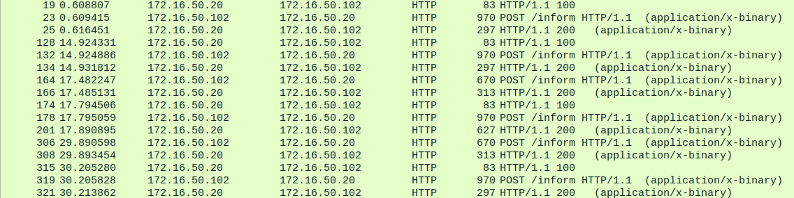

# Unifi reverse engineering

## Description

It would be quite nice to know how the whole Unifi eco system works from a technical stand point.

## Unifi AC-Pro

The victim of the dissection is in my case a Unifi AC-Pro. It seems to run a very recent Kernel. Good Job Ubiquiti! It also seems that the base Image is built around a heavy modified LEDE(/OpenWRT).


```
# uname -a\
Linux WIFIEG2 4.4.153 #0 Thu Aug 30 12:10:54 2018 mips GNU/Linux\
# cat /etc/os-release\
NAME="LEDE"\
VERSION="17.01.6, Reboot"
```


## Unifi Controller communication

It looks that they use a custom (not cleartext) Binary format to provision AP's.


